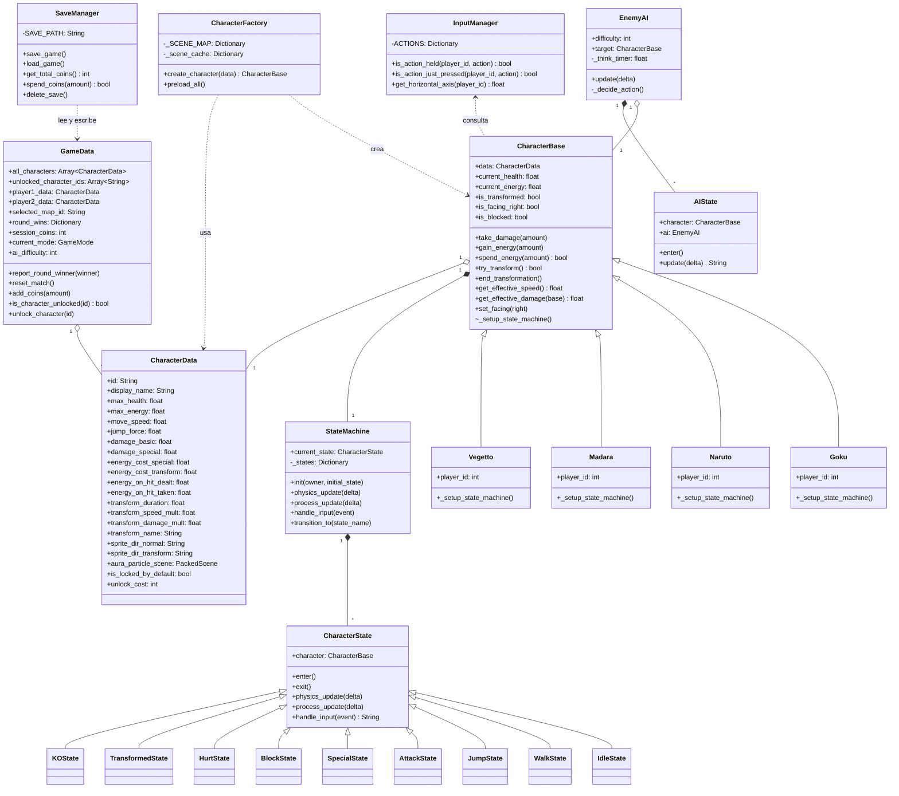
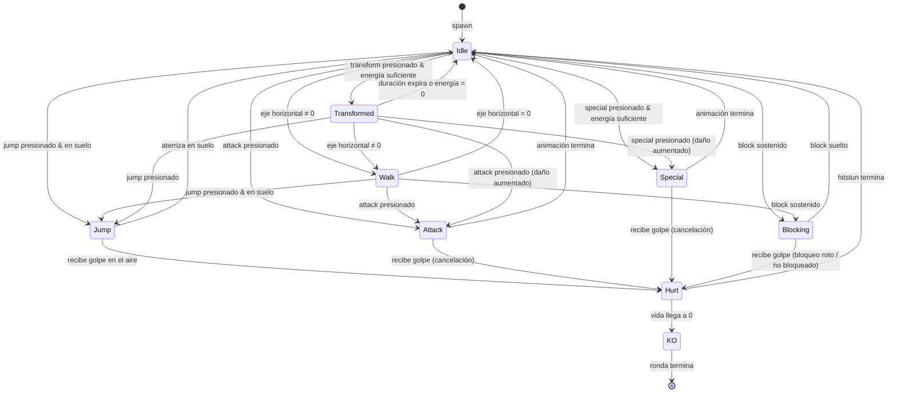
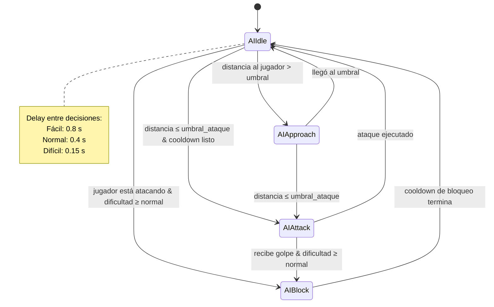

# Diagramas — Juego de Pelea 2D

## 1. Diagrama de Clases

```mermaid
classDiagram
    direction TB

    %% ── Autoloads (Singletons) ──────────────────────────────────────────
    class GameData {
        +all_characters: Array~CharacterData~
        +unlocked_character_ids: Array~String~
        +player1_data: CharacterData
        +player2_data: CharacterData
        +selected_map_id: String
        +round_wins: Dictionary
        +session_coins: int
        +current_mode: GameMode
        +ai_difficulty: int
        +report_round_winner(winner)
        +reset_match()
        +add_coins(amount)
        +is_character_unlocked(id) bool
        +unlock_character(id)
    }

    class SaveManager {
        -SAVE_PATH: String
        +save_game()
        +load_game()
        +get_total_coins() int
        +spend_coins(amount) bool
        +delete_save()
    }

    class CharacterFactory {
        -_SCENE_MAP: Dictionary
        -_scene_cache: Dictionary
        +create_character(data) CharacterBase
        +preload_all()
    }

    class InputManager {
        -ACTIONS: Dictionary
        +is_action_held(player_id, action) bool
        +is_action_just_pressed(player_id, action) bool
        +get_horizontal_axis(player_id) float
    }

    %% ── Resources (Datos) ───────────────────────────────────────────────
    class CharacterData {
        +id: String
        +display_name: String
        +max_health: float
        +max_energy: float
        +move_speed: float
        +jump_force: float
        +damage_basic: float
        +damage_special: float
        +energy_cost_special: float
        +energy_cost_transform: float
        +energy_on_hit_dealt: float
        +energy_on_hit_taken: float
        +transform_duration: float
        +transform_speed_mult: float
        +transform_damage_mult: float
        +transform_name: String
        +sprite_dir_normal: String
        +sprite_dir_transform: String
        +aura_particle_scene: PackedScene
        +is_locked_by_default: bool
        +unlock_cost: int
    }

    %% ── Personajes ──────────────────────────────────────────────────────
    class CharacterBase {
        +data: CharacterData
        +current_health: float
        +current_energy: float
        +is_transformed: bool
        +is_facing_right: bool
        +is_blocked: bool
        +take_damage(amount)
        +gain_energy(amount)
        +spend_energy(amount) bool
        +try_transform() bool
        +end_transformation()
        +get_effective_speed() float
        +get_effective_damage(base) float
        +set_facing(right)
        ~_setup_state_machine()
    }

    class Goku {
        +player_id: int
        +_setup_state_machine()
    }

    class Naruto {
        +player_id: int
        +_setup_state_machine()
    }

    class Madara {
        +player_id: int
        +_setup_state_machine()
    }

    class Vegetto {
        +player_id: int
        +_setup_state_machine()
    }

    %% ── Máquina de Estados ──────────────────────────────────────────────
    class StateMachine {
        +current_state: CharacterState
        -_states: Dictionary
        +init(owner, initial_state)
        +physics_update(delta)
        +process_update(delta)
        +handle_input(event)
        +transition_to(state_name)
    }

    class CharacterState {
        +character: CharacterBase
        +enter()
        +exit()
        +physics_update(delta)
        +process_update(delta)
        +handle_input(event) String
    }

    class IdleState
    class WalkState
    class JumpState
    class AttackState
    class SpecialState
    class BlockState
    class HurtState
    class TransformedState
    class KOState

    %% ── IA ──────────────────────────────────────────────────────────────
    class EnemyAI {
        +difficulty: int
        +target: CharacterBase
        -_think_timer: float
        +update(delta)
        -_decide_action()
    }

    class AIState {
        +character: CharacterBase
        +ai: EnemyAI
        +enter()
        +update(delta) String
    }

    %% ── Relaciones ──────────────────────────────────────────────────────
    CharacterBase <|-- Goku
    CharacterBase <|-- Naruto
    CharacterBase <|-- Madara
    CharacterBase <|-- Vegetto

    CharacterBase "1" *-- "1" StateMachine
    CharacterBase "1" o-- "1" CharacterData

    StateMachine "1" *-- "*" CharacterState
    CharacterState <|-- IdleState
    CharacterState <|-- WalkState
    CharacterState <|-- JumpState
    CharacterState <|-- AttackState
    CharacterState <|-- SpecialState
    CharacterState <|-- BlockState
    CharacterState <|-- HurtState
    CharacterState <|-- TransformedState
    CharacterState <|-- KOState

    EnemyAI "1" o-- "1" CharacterBase
    EnemyAI "1" *-- "*" AIState

    CharacterFactory ..> CharacterBase : crea
    CharacterFactory ..> CharacterData : usa
    GameData "1" o-- "*" CharacterData
    SaveManager ..> GameData : lee y escribe
    InputManager <.. CharacterBase : consulta
```

---

## 2. Diagrama de Estados — Personaje Jugable

```mermaid
stateDiagram-v2
    [*] --> Idle : spawn

    Idle --> Walk        : eje horizontal ≠ 0
    Idle --> Jump        : jump presionado & en suelo
    Idle --> Attack      : attack presionado
    Idle --> Special     : special presionado & energía suficiente
    Idle --> Blocking    : block sostenido
    Idle --> Transformed : transform presionado & energía suficiente

    Walk --> Idle        : eje horizontal = 0
    Walk --> Jump        : jump presionado & en suelo
    Walk --> Attack      : attack presionado
    Walk --> Blocking    : block sostenido

    Jump --> Idle        : aterriza en suelo
    Jump --> Hurt        : recibe golpe en el aire

    Attack --> Idle      : animación termina
    Attack --> Hurt      : recibe golpe (cancelación)

    Special --> Idle     : animación termina
    Special --> Hurt     : recibe golpe (cancelación)

    Blocking --> Idle    : block suelto
    Blocking --> Hurt    : recibe golpe (bloqueo roto / no bloqueado)

    Hurt --> Idle        : hitstun termina
    Hurt --> KO          : vida llega a 0

    Transformed --> Walk     : eje horizontal ≠ 0
    Transformed --> Jump     : jump presionado
    Transformed --> Attack   : attack presionado (daño aumentado)
    Transformed --> Special  : special presionado (daño aumentado)
    Transformed --> Idle     : duración expira o energía = 0

    KO --> [*]           : ronda termina
```

---

## 3. Diagrama de Estados — IA Enemiga

```mermaid
stateDiagram-v2
    [*] --> AIIdle

    AIIdle --> AIApproach  : distancia al jugador > umbral
    AIIdle --> AIAttack    : distancia ≤ umbral_ataque & cooldown listo
    AIIdle --> AIBlock     : jugador está atacando & dificultad ≥ normal

    AIApproach --> AIIdle  : llegó al umbral
    AIApproach --> AIAttack: distancia ≤ umbral_ataque

    AIAttack --> AIIdle    : ataque ejecutado
    AIAttack --> AIBlock   : recibe golpe & dificultad ≥ normal

    AIBlock --> AIIdle     : cooldown de bloqueo termina

    note right of AIIdle
        Delay entre decisiones:
        Fácil: 0.8 s
        Normal: 0.4 s
        Difícil: 0.15 s
    end note
```

